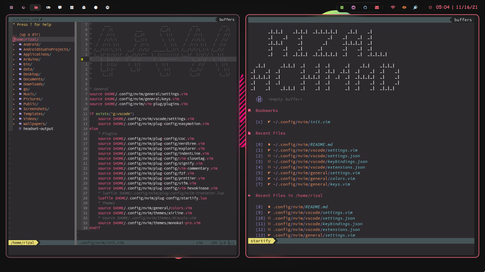

# My Neovim Config




To use this config, first download some dependencies:

## automatic
just run the bash script `setup.sh`
```bash
$ ./setup.sh

Then execute **```:PlugInstall```** inside neovim and it should be ready.
