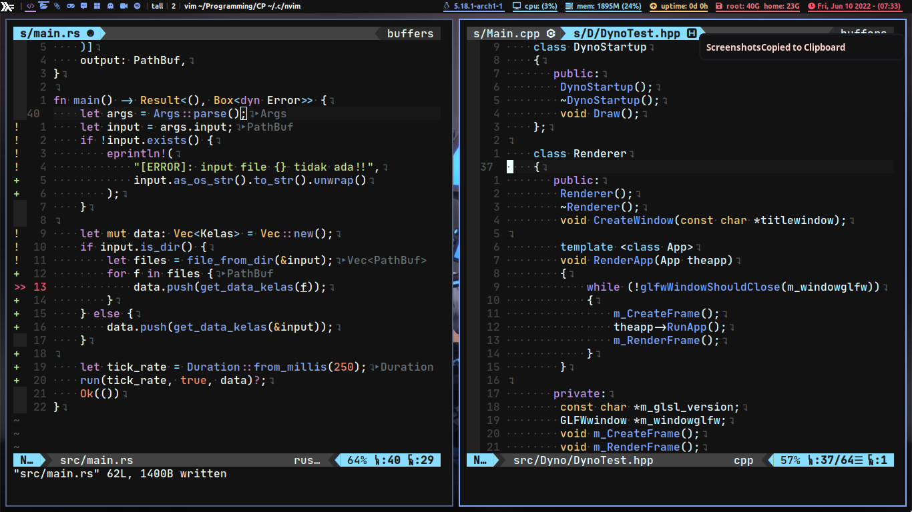

# My Neovim Config




To use this config, first download some dependencies:

```bash
# download Vim-plug
sh -c 'curl -fLo "${XDG_DATA_HOME:-$HOME/.local/share}"/nvim/site/autoload/plug.vim --create-dirs \
       https://raw.githubusercontent.com/junegunn/vim-plug/master/plug.vim'
```

```bash
# Some runtimes are needed, install only those you don't have
sudo pacman -S nodejs npm python python-pip ruby rubygems

# if you using debian/ubuntu base distro, use apt
sudo apt install nodejs npm python python-pip ruby rubygems

```

```bash
# Download neovim packages
pip install neovim
gem install neovim
sudo npm i -g neovim
```

```bash
# Some other dependencies
sudo pacman -S xsel fzf ripgrep fd the_silver_searcher prettier
yay -S universal-ctags-git

# debian / ubuntu base distro
sudo apt install xsel fzf ripgrep fd the_silver_searcher prettier
# or just install download it from the source.(git)
```

Then execute **```:PlugInstall```** inside neovim and it should be ready.
